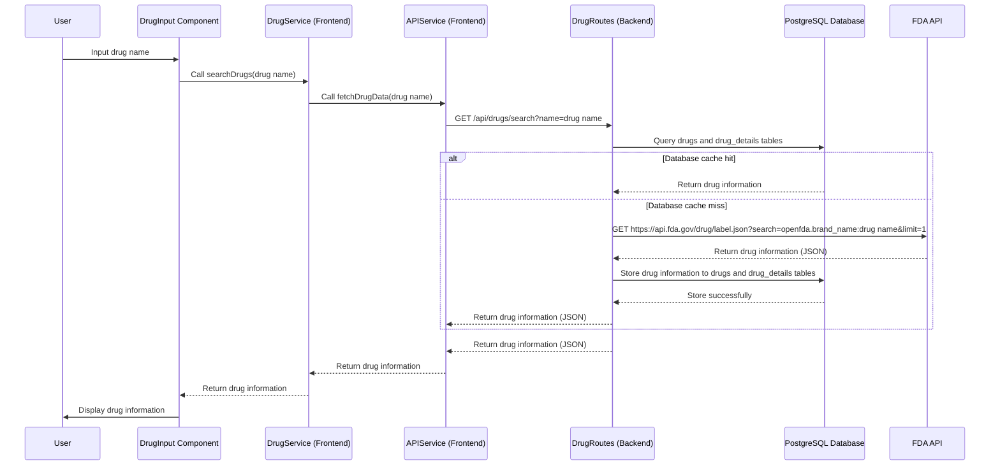
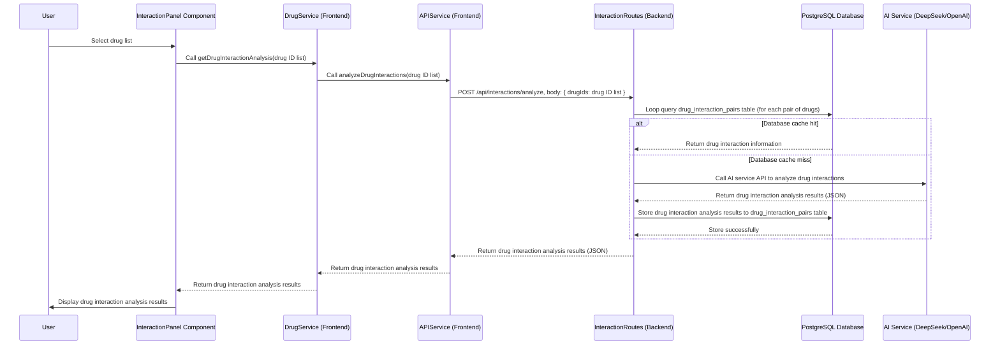
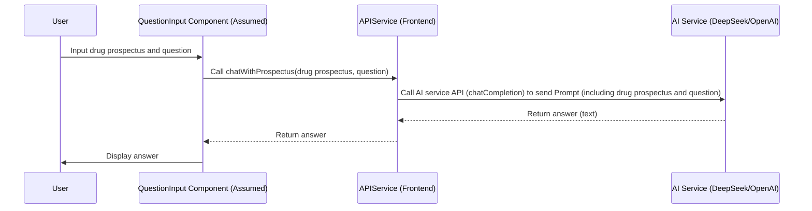

# Analysis Report of Drug Information Query System

## File Structure

```
.
├── .env
├── .gitignore
├── eslint.config.js
├── index.html
├── package-lock.json
├── package.json
├── postcss.config.js
├── README.md
├── tailwind.config.js
├── tsconfig.app.json
├── tsconfig.json
├── tsconfig.node.json
├── vite.config.ts
├── analysis/
├── server/
│   ├── .env
│   ├── package-lock.json
│   ├── package.json
│   ├── server.ts
│   ├── db/
│   │   ├── db.ts
│   │   └── schema.sql
│   └── routes/
│       ├── drugRoutes.ts
│       └── interactionRoutes.ts
├── src/
│   ├── App.tsx
│   ├── index.css
│   ├── main.tsx
│   ├── types.ts
│   ├── vite-env.d.ts
│   ├── components/
│   │   ├── DrugCard.tsx
│   │   ├── DrugDetails.tsx
│   │   ├── DrugInput.tsx
│   │   ├── InteractionPanel.tsx
│   │   └── PrescriptionInfo.tsx
│   ├── config/
│   │   └── aiConfig.ts
│   ├── data/
│   │   └── drugDatabase.ts
│   ├── services/
│   │   ├── api.ts
│   │   ├── drugService.ts
│   │   └── ai/
│   │       ├── AIServiceFactory.ts
│   │       ├── DeepSeekProvider.ts
│   │       ├── IAIProvider.ts
│   │       └── OpenAIProvider.ts
│   ├── types/
│   │   └── api.ts
│   └── utils/
│       └── drugInteractions.ts
└── report2.md
```

## Technical Architecture Analysis

### Overall Architecture

This project adopts a front-end and back-end separated architecture pattern.

* **Frontend**: Uses React framework to build the user interface, Vite as the build tool, TypeScript as the development language, and Tailwind CSS for styling.
* **Backend**: Uses Node.js runtime environment, Express framework to build RESTful APIs, TypeScript as the development language, and PostgreSQL database to store data.

### Technology Stack

* **Frontend**:
    * React
    * Vite
    * TypeScript
    * Tailwind CSS
    * axios (HTTP client)
* **Backend**:
    * Node.js
    * Express
    * TypeScript
    * PostgreSQL
    * dotenv (environment variable management)
    * uuid (UUID generation)
    * axios (HTTP client, for calling FDA API and DeepSeek API)
    * cors (Cross-Origin Resource Sharing)
* **AI Services**:
    * DeepSeek API (default) or OpenAI API (optional, configurable)

### Core Functional Modules

1. **Drug Information Query Module**:
    * Frontend Components: `src/components/DrugInput.tsx`, `src/components/DrugCard.tsx`, `src/components/DrugDetails.tsx`
    * Frontend Service: `src/services/drugService.ts` (`searchDrugs` function)
    * Backend API: `server/routes/drugRoutes.ts` (`/api/drugs/search` route)
    * Data Sources: PostgreSQL database (`drugs` table, `drug_details` table) and FDA API (when no data in database)
    * Functionality Description: User inputs drug name, system queries database and FDA API to get drug information, and displays it on the frontend. It has a caching mechanism, prioritizing querying the local database to reduce dependence on external APIs.

2. **Drug Interaction Query Module**:
    * Frontend Component: `src/components/InteractionPanel.tsx`
    * Frontend Service: `src/services/drugService.ts` (`getDrugInteractionAnalysis` function)
    * Backend API: `server/routes/interactionRoutes.ts` (`/api/interactions/analyze` route)
    * AI Service: DeepSeek API or OpenAI API (for analyzing drug interactions)
    * Data Sources: PostgreSQL database (`drug_interaction_pairs` table) and AI service (when no data in database)
    * Functionality Description: User selects two or more drugs, system calls AI service to analyze drug interactions, and stores the analysis results in the database. Next time querying the same drug combination, it directly retrieves results from the database. It has a caching mechanism to avoid repeated calls to the AI service.

3. **Drug Prospectus Q&A Module (Prospectus Chat)**:
    * Frontend API: `src/services/api.ts` (`chatWithProspectus` function)
    * AI Service: DeepSeek API or OpenAI API (for analyzing drug prospectuses and answering user questions)
    * Functionality Description: User can upload a drug prospectus and ask AI questions about the prospectus content. The AI service answers user questions based on the prospectus content.

### AI Service Configuration

* Configured through `src/config/aiConfig.ts` file.
* Supports DeepSeek API (default) and OpenAI API.
* AI service provider can be switched via environment variable `VITE_AI_PROVIDER` (`'deepseek'` or `'openai'`).
* API Base URL, API Key, Model Name, and other parameters of AI services are also configured via environment variables.

## Functional Logic and Workflow Analysis

### 1. Drug Information Query Function

**Logic:**

1. Frontend receives the drug name input by the user.
2. Frontend calls the backend API `/api/drugs/search`, passing the drug name.
3. Backend API first queries the database cache.
4. If the cache hits, it directly returns the cached data.
5. If the cache misses, it calls the FDA API to get data and stores it in the database.
6. Backend API returns drug information.
7. Frontend displays drug information.

**Workflow:**



### 2. Drug Interaction Query Function

**Logic:**

1. Frontend receives the list of drugs selected by the user.
2. Frontend calls the backend API `/api/interactions/analyze`, passing the drug ID list.
3. Backend API pairs the drug list two by two.
4. Loop through each pair of drugs, backend API first queries the database cache.
5. If the cache hits, it directly returns the cached data.
6. If the cache misses, it calls the AI service (DeepSeek/OpenAI) to analyze drug interactions and stores them in the database.
7. Backend API returns drug interaction analysis results.
8. Frontend displays drug interaction analysis results.

**Workflow:**



### 3. Drug Prospectus Q&A Function

**Logic:**

1. Frontend receives the drug prospectus and question input by the user.
2. Frontend calls the API function `chatWithProspectus`, passing the drug prospectus and question.
3. Frontend API function constructs a Prompt and calls the AI service API for Q&A.
4. AI service API returns the answer.
5. Frontend displays the answer.

**Workflow:**



## Detailed Analysis of Key Files

### 1. `server/server.ts` - Backend Server Entry File

* **Functional Modules**:
    * **Express Application Initialization**: Creates an Express application instance, configures middleware (cors, express.json).
    * **Database Connection Test**: Defines the root route `/` for testing whether the database connection is normal.
    * **Route Mounting**: Mounts `drugRoutes` and `interactionRoutes` to handle API requests related to drug information and drug interactions.
    * **Port Listening**: Starts the HTTP server and listens on the specified port (obtained from the environment variable `PORT` or default port 3001).
* **Data Flow**:
    * **Request Receiving**: Receives HTTP requests (GET, POST) from the frontend.
    * **Route Dispatch**: Dispatches requests to different route handling modules (`drugRoutes`, `interactionRoutes`) based on the request path.
    * **Response Returning**: Returns the data returned by the route handling module as an HTTP response to the frontend.

### 2. `server/routes/drugRoutes.ts` - Drug Information Query API Route

* **Functional Modules**:
    * **Drug Query Route (`/api/drugs/search`)**:
        * **Parameter Parsing**: Parses the query parameter `name` (drug name).
        * **Database Query**: Queries the PostgreSQL database `drugs` and `drug_details` tables to check if drug information is cached.
        * **Cache Handling**:
            * **Cache Hit**: Returns the cached drug information from the database and updates the `last_queried` field.
            * **Cache Miss**: Calls the FDA API to get drug information.
        * **FDA API Call**: Uses `axios` to call the FDA API (`https://api.fda.gov/drug/label.json`) to query drug information.
        * **Data Storage**: Stores the drug information returned by the FDA API into the PostgreSQL database `drugs` and `drug_details` tables.
        * **Log Recording**: Records query logs to the `query_logs` table, including whether the cache was hit, response time, etc.
        * **Result Transformation**: Uses the `transformDrugRecord` function to transform database records into the data structure required by the frontend.
        * **Response Returning**: Returns drug information (in JSON format) to the frontend.
        * **Error Handling**: Handles potential errors during database queries and FDA API calls.
* **Data Flow**:
    * **Request Receiving**: Receives GET requests from the frontend `/api/drugs/search?name=drug name`.
    * **Database Interaction**: Queries `drugs`, `drug_details`, and `query_logs` tables, updates the `drugs` table.
    * **FDA API Call**: Sends HTTP requests to the FDA API.
    * **Data Transformation**: Transforms database query results into the data structure required by the frontend.
    * **Response Returning**: Returns drug information (in JSON format) to the frontend.

### 3. `server/routes/interactionRoutes.ts` - Drug Interaction Query API Route

* **Functional Modules**:
    * **Drug Interaction Analysis Route (`/api/interactions/analyze`)**:
        * **Parameter Parsing**: Parses the `drugIds` field (drug ID list) in the request body.
        * **Drug Pairing**: Uses the `generatePairs` function to generate all pairwise combinations of drug IDs.
        * **Loop Processing of Drug Pairs**: Iterates through each drug pair.
        * **Database Query**: Queries the PostgreSQL database `drug_interaction_pairs` table to check if drug interaction information is cached.
        * **Cache Handling**:
            * **Cache Hit**: Returns the cached drug interaction information from the database.
            * **Cache Miss**: Calls the AI service (DeepSeek API) to analyze drug interactions.
        * **AI Service Call**: Uses the `callOpenAIForPair` function to call the DeepSeek API for drug interaction analysis.
        * **Data Storage**: Stores the drug interaction analysis results returned by the AI service into the PostgreSQL database `drug_interaction_pairs` table.
        * **Data Query (Drug Names)**: Uses the `getDrugNamesByIds` function to query the `drugs` table in the database to get drug names based on drug IDs, for returning more user-friendly results.
        * **Result Transformation**: Transforms database records or AI service returned results into the data structure required by the frontend.
        * **Response Returning**: Returns drug interaction analysis results (in JSON format) to the frontend.
        * **Error Handling**: Handles potential errors during database queries and AI service calls.
* **Data Flow**:
    * **Request Receiving**: Receives POST requests from the frontend `/api/interactions/analyze`, request body contains `drugIds`.
    * **Database Interaction**: Queries `drug_interaction_pairs` and `drugs` tables, stores data into the `drug_interaction_pairs` table.
    * **AI Service Call**: Sends HTTP requests to the DeepSeek API.
    * **Data Transformation**: Transforms database query results or AI service returned results into the data structure required by the frontend.
    * **Response Returning**: Returns drug interaction analysis results (in JSON format) to the frontend.

### 4. `src/services/api.ts` - Frontend API Service

* **Functional Modules**:
    * **`analyzeTextWithAI(prompt: string)`**: Generic AI text analysis function.
        * **AI Service Provider Creation**: Uses `AIServiceFactory.createProvider()` to create an AI service provider instance.
        * **AI Service API Call**: Calls the `chatCompletion` method of the AI service provider to send a Prompt and get the AI response.
        * **Error Handling**: Handles potential errors during AI service API calls.
    * **`fetchDrugData(drugName: string)`**: Function to get drug data.
        * **Backend API Call**: Uses `axios.get` to call the backend `/api/drugs/search` API.
        * **Error Handling**: Handles potential errors during backend API calls.
    * **`analyzeDrugInteractions(drugIds: string[])`**: Function to analyze drug interactions.
        * **Backend API Call**: Uses `axios.post` to call the backend `/api/interactions/analyze` API.
        * **Error Handling**: Handles potential errors during backend API calls.
    * **`chatWithProspectus(prospectus: string, question: string)`**: Drug prospectus Q&A function.
        * **Prompt Construction**: Constructs a Prompt containing the drug prospectus and question.
        * **`analyzeTextWithAI` Call**: Calls the `analyzeTextWithAI` function for AI analysis.
        * **Error Handling**: Handles potential errors during `analyzeTextWithAI` calls.
* **Data Flow**:
    * **Request Sending**: Sends HTTP requests to the backend API (`/api/drugs/search`, `/api/interactions/analyze`) and AI service API (DeepSeek/OpenAI).
    * **Response Receiving**: Receives HTTP responses from the backend API and AI service API.
    * **Data Passing**: Passes data to frontend services (`drugService.ts`) and components.

### 5. `src/services/drugService.ts` - Frontend Drug Data Service

* **Functional Modules**:
    * **`searchDrugs(drugName: string)`**: Drug search function.
        * **`api.fetchDrugData` Call**: Calls the `fetchDrugData` function in `api.ts` to get drug data.
        * **Data Transformation**: Transforms the data returned by the API (although the transformation in the code is very simple, just wrapping it into an array).
        * **Result Returning**: Returns drug data of type `Drug[]`.
    * **`getDrugInteractionAnalysis(drugIds: string[])`**: Function to get drug interaction analysis results.
        * **`api.analyzeDrugInteractions` Call**: Calls the `analyzeDrugInteractions` function in `api.ts` to get drug interaction data.
        * **Data Transformation**: Transforms the data returned by the API, converting the `pairs` array to `AnalysisResult[]` type.
        * **Result Returning**: Returns drug interaction analysis results of type `AnalysisResult[]`.
    * **`getDrugSummary(drug: Drug)`**: Function to generate drug summary information.
        * **Data Extraction**: Extracts drug information from the `Drug` object (name, category, indications, warnings, mechanismOfAction, dosage).
        * **String Concatenation**: Concatenates the extracted information into a string to generate a drug summary.
        * **Result Returning**: Returns the drug summary string.
* **Data Flow**:
    * **Request Receiving**: Receives function call requests from frontend components (e.g., `searchDrugs`, `getDrugInteractionAnalysis`), parameters are drug name or drug ID list.
    * **API Service Call**: Calls API functions in `api.ts` (`fetchDrugData`, `analyzeDrugInteractions`) to get data.
    * **Data Transformation**: Transforms the data returned by the API.
    * **Result Returning**: Returns the processed data to frontend components.

### 6. `src/services/ai/AIServiceFactory.ts` - AI Service Factory

* **Functional Modules**:
    * **`createProvider()` Static Method**:
        * **Configuration Reading**: Reads AI service configuration from `src/config/aiConfig.ts` (`aiConfig.provider`).
        * **Provider Selection**: Selects AI service provider based on the value of `aiConfig.provider`.
        * **'openai'**: Selects `OpenAIProvider`.
        * **'deepseek' or default**: Selects `DeepSeekProvider`.
        * **Provider Creation**: Creates an instance of the selected AI service provider (`new OpenAIProvider()` or `new DeepSeekProvider()`).
        * **Instance Returning**: Returns the created `IAIProvider` interface instance.
* **Data Flow**:
    * **Configuration Reading**: Reads AI service configuration from `aiConfig.ts`.
    * **Instance Creation**: Creates different AI service provider instances based on the configuration.
    * **Instance Returning**: Returns the AI service provider instance to the caller (the `analyzeTextWithAI` function in `api.ts`).

### 7. `src/config/aiConfig.ts` - AI Service Configuration

* **Functional Modules**:
    * **Configuration Definition**: Defines the `AIConfig` interface, describing the structure of AI service configuration (provider, baseUrl, apiKey, model).
    * **Configuration Loading**: Uses IIFE to read AI service configuration from environment variables (`import.meta.env`) and assigns it to the `aiConfig` constant.
        * **Provider Acquisition**: Gets the AI service provider type from the `VITE_AI_PROVIDER` environment variable, defaults to `'deepseek'`.
        * **Dynamic Configuration**: Dynamically reads configuration items such as `baseUrl`, `apiKey`, `model` from environment variables based on the value of `provider`, e.g., `VITE_DEEPSEEK_BASE_URL`, `VITE_DEEPSEEK_API_KEY`, `VITE_DEEPSEEK_MODEL` or `VITE_OPENAI_BASE_URL`, `VITE_OPENAI_API_KEY`, `VITE_OPENAI_MODEL`.
* **Data Flow**:
    * **Environment Variable Reading**: Reads environment variables from Vite's `import.meta.env` object.
    * **Configuration Export**: Exports the loaded AI service configuration as the `aiConfig` constant for use by other modules (`AIServiceFactory.ts`).

### 8. `src/components/DrugInput.tsx` - Drug Information Input Component

* **Functional Modules**:
    * **User Input**: Provides a text input box to allow users to enter drug names.
    * **Search Trigger**: Listens to user input events (e.g., `onChange`, `onSubmit`). When the user inputs or submits a drug name, it triggers a drug search operation.
    * **`drugService.searchDrugs` Call**: Calls the `searchDrugs` function in `src/services/drugService.ts`, passing the drug name input by the user.
    * **Result Display**: Receives drug information returned by the `searchDrugs` function and passes the drug information to `DrugCard` or `DrugDetails` components for display (the specific display logic may be in the parent component or related state management).
* **Data Flow**:
    * **User Input**: Receives the drug name input by the user in the text input box.
    * **Service Call**: Calls the `drugService.searchDrugs` function, passing the drug name.
    * **Data Receiving**: Receives drug information returned by the `drugService.searchDrugs` function.
    * **Component Rendering**: Passes drug information to child components (`DrugCard`, `DrugDetails`) or updates component state, triggers UI updates, and displays drug information.

### 9. `src/components/InteractionPanel.tsx` - Drug Interaction Panel Component

* **Functional Modules**:
    * **Drug Selection**: Allows users to select two or more drugs, e.g., through a search box + list display, checkboxes, etc.
    * **Interaction Analysis Trigger**: Provides buttons or operations to allow users to trigger drug interaction analysis.
    * **`drugService.getDrugInteractionAnalysis` Call**: When the user triggers analysis, it gets the list of drug IDs selected by the user and calls the `getDrugInteractionAnalysis` function in `src/services/drugService.ts`, passing the drug ID list.
    * **Result Display**: Receives drug interaction analysis results returned by the `getDrugInteractionAnalysis` function and displays the results to the user (e.g., in the form of a list, table, or text).
* **Data Flow**:
    * **User Selection**: Receives the list of drugs (IDs or names) selected by the user.
    * **Service Call**: Calls the `drugService.getDrugInteractionAnalysis` function, passing the drug ID list.
    * **Data Receiving**: Receives drug interaction analysis results returned by the `drugService.getDrugInteractionAnalysis` function.
    * **Component Rendering**: Displays drug interaction analysis results to the user, triggers UI updates.